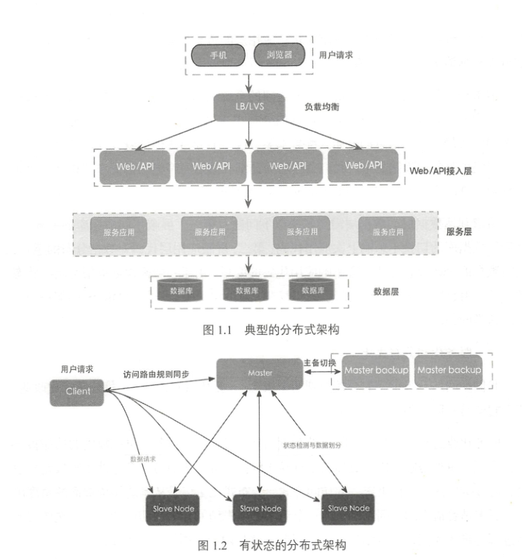
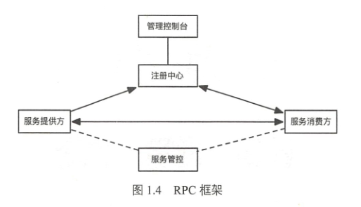
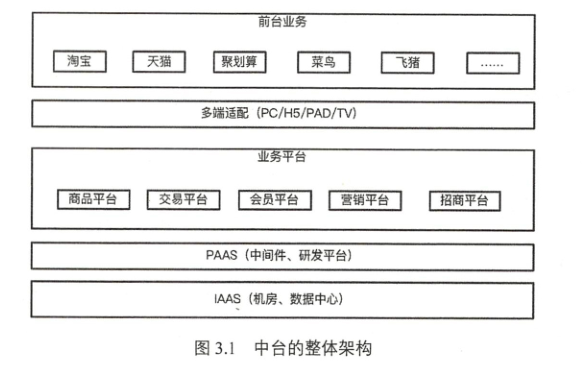
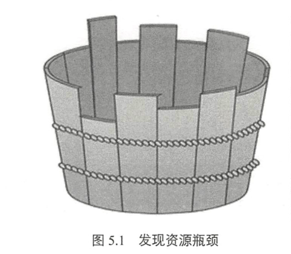
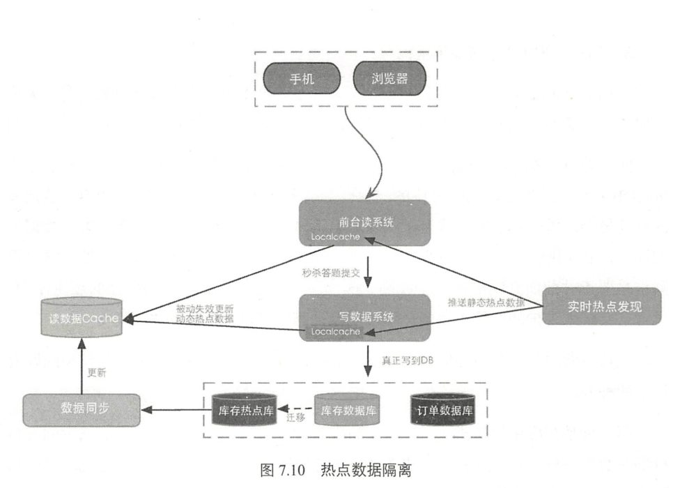
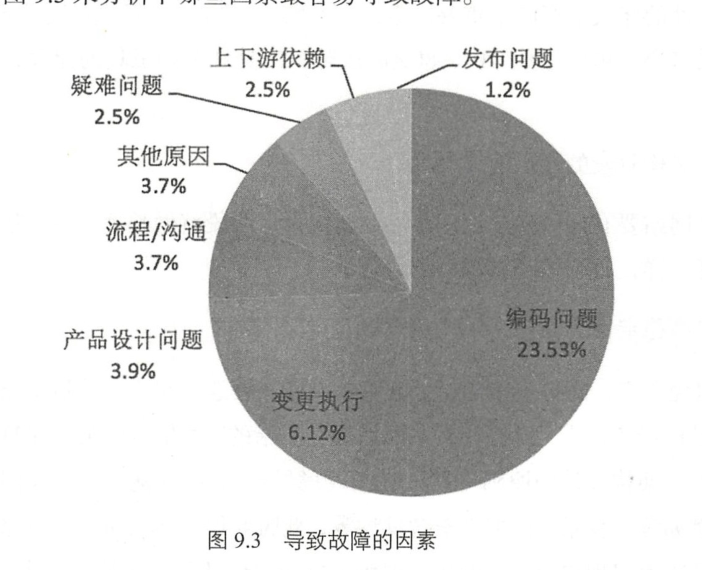

## 分布式改造
1. 分布式解决了横向扩展和纵向扩展问题

2. 分布式RPC框架 （服务注册、发现、调度与负载均衡、统一SDK封装）

3. 分布式消息框架 （kafka、redis、RabbitMQ等）
4. 分布式数据层 （分库分表、读写分离）
5. 应用的服务化改造
    - 应用分层设计 （服务层、业务层、数据层）
    - 微服务化
6. 典型问题
    - 集群管理
    - 共享锁
    - 队列管理
7. 分布式消息通道服务设计（移动APP和服务端都需要上传、推送大量消息）

## 移动网络时代的架构演进
1. 新挑战 （端的问题、服务端的问题、多端登陆与多屏互动）
2. 端的演进 （Native or HTML5）
3. 无线端链路的优化
    - 请求合并
    - 数据量大小的影响
    - CDN加速
    - WebP图片优化
4. 服务端的演进
    - 数据JSON化、标准化
    - 业务层组件化 （canary报表）
    - MC与C的分离
5. 开发语言管理

## 平台化演进：大中台小前台
1. 中台
    - 定位
    
2. 提升中台开发效率
    - 沟通、开发、测试、运维

## 全球部署方案
1. 国际化背景 （天猫国际、速卖通）
    - 国内系统复制到海外，独立
    - 海外建设个性化系统、数据互通
2. 挑战 （单元化、一套代码、服务本地与数据共享、区域容灾）

## 应用程序优化：代码级优化

1. 优化思路
    - 测压工具（pprof等）
    - 发现瓶颈
2. 影响系统的关键因素（提升系统QPS）
3. 语言特性的优化
4. 减少并发冲突
5. 使用长连接

## 大秒系统的极致优化思路
1. 热点隔离 （禁止1%的请求影响99%的请求）
    - 业务隔离
    - 系统隔离
    - 数据隔离
2. 动静分离
3. 基于时间分片业务削峰（业务削峰）
4. 分层式数据校验
5. 关键技术优化
    - 大并发动态请求优化
    - 同一资源被大并发读问题（应用层缓存,动态资源动态更新）
    - 同一数据大并发写的问题 （在mysql一行存储，大量写请求会有大量线程来竞争InnoDB行锁，并发度越高等待的线程会越多。 隔离；应用层排队；数据库层排队）
    

## 全局资源调度优化
1. 资源调度
    - 提升稳定性和运维效率
    - 统一资源抽象
2. 资源抽象
3. 应用层调度

## 大型网站的稳定性建设
1. 网站的可用性指标（常用4个9 99.99%）
    - 平均无故障工作时间MTBF
    - 故障恢复时间MTTR
    - 可用性= MTBF（MTBF+MTTR）
    

2. 稳定性建设思路 
    - 开发人员对稳定性的重视
    - 规范和工具的建设
    - 架构阶段：
        - 避免单点
        - 微服务化
        - 异步化
        - 异地容灾
    - 编码截断稳定性建设:
        - 错误捕获
        - 异步线程
        - 超时处理
        - 限流保护
    - 测试阶段：
        - 测试代码
        - Beta测试
    - 发布阶段
        - 分批发布
        - 多版本发布
    - 运行阶段
        - 实时监控
        - 过载保护和自动降级
        - 实时数据对账
    - 故障发生时
        - 故障定位（90%由于变更所致）
        - 快速恢复
3. 体系化建设
    - 测压体系
    - 管控体系
    - 监控体系
    - 恢复体系
4. 研发人员
    - 向全栈工程师转变
    - 向全链路运维转变
